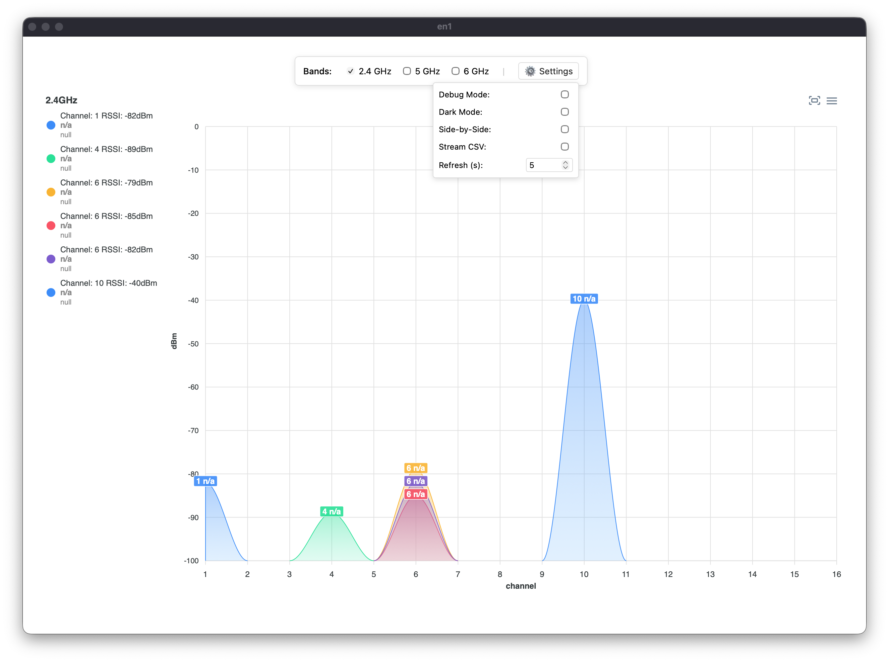
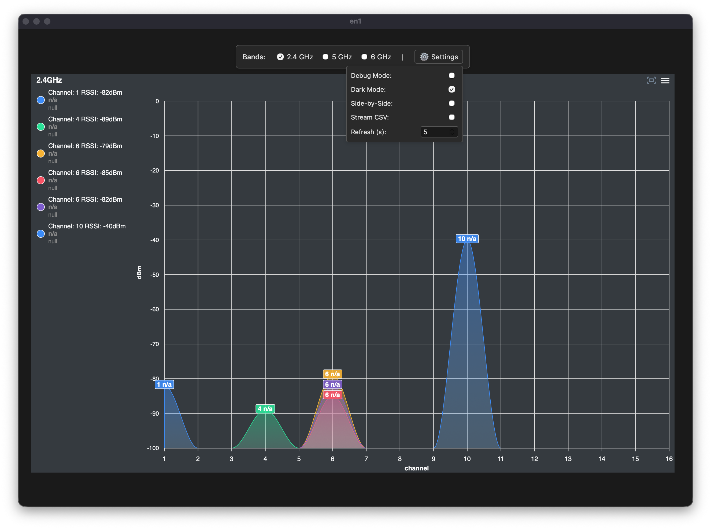
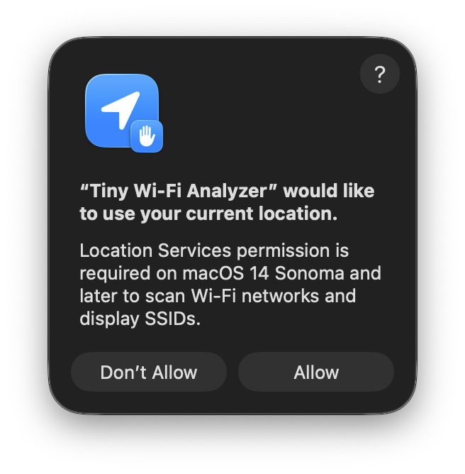
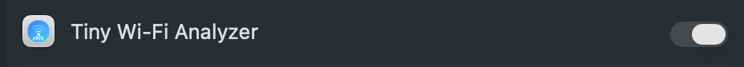

# Tiny Wi-Fi Analyzer

Simple, open-source Wi-Fi channel and strength analyzer for macOS.
Made with PyObjC, pywebview, ApexCharts, and PyInstaller.

Forked from [nolze/tiny-wifi-analyzer](https://github.com/nolze/tiny-wifi-analyzer)

### Light Mode
<p align="center">
  
</p>

### Dark Mode
<p align="center">
  
</p>

## Features

* Real-time updates of Wi-Fi networks
* Support for 2.4 GHz, 5 GHz, and 6 GHz Wi‑Fi bands
* Highlight the chart for the selected SSID
* Settings menu with persistent configuration:
  - Debug mode toggle
  - Dark mode (auto, light, or dark)
  - Side-by-side or stacked layout
  - CSV streaming for continuous data logging
  - Adjustable refresh interval (0.1-10 seconds)
* Export charts as images (PNG or SVG)
* Export chart data as a CSV file
* Full-screen mode for individual band charts

## Requirements

* macOS 10.15 (Catalina) or later
* **macOS 14 Sonoma and later**: Location Services permission is required to display Wi-Fi SSIDs

## Download

[Visit the latest release](https://github.com/soinkleined/tiny-wifi-analyzer/releases/latest/)

### Installation Notes

Because the application is not code-signed, you will need to follow these steps to run it:

1. **Right-click on the app icon**
2. Select "Open" from the context menu
3. Click "Open" in the security dialog

<p align="center">
  
</p>

### Location Services Permission (macOS 14+)

On macOS 14 Sonoma and later, you must grant Location Services permission for the app to display Wi-Fi SSIDs:

1. **Grant permission on first launch** - The app will display this prompt:

   <p align="center">
     
   </p>

2. **Enable manually if needed** - Go to **System Settings > Privacy & Security > Location Services**, find "Tiny Wi-Fi Analyzer" and enable it:

   <p align="center">
     
   </p>

3. **Restart the app** after granting permission

## Todos

* [x] Bundle scripts with Parcel
* [x] Prepare GitHub Pages
* [x] Settings menu with persistent configuration
* [x] CSV streaming for data logging
* [x] Full-screen mode for charts
* [x] PyInstaller build script for macOS
* [ ] Code signing for easier installation
* [ ] Support for additional export formats

## Mentions

- [Bezplatné macOS aplikace, které stojí za pozornost [Free macOS apps worth paying attention to] – Jablíčkář.cz](https://jablickar.cz/bezplatne-macos-aplikace-ktere-stoji-za-pozornost-stredove-tlacitko-prepinani-aplikaci-a-virtualizace/4/)
- [What are your favourite open-source apps? : r/macapps](https://www.reddit.com/r/macapps/comments/140bl4x/comment/jmx1o5g/)
- [„Breitbandmessung Desktop“ aktualisiert – „Tiny Wi-Fi Analyzer“ neu › ifun.de](https://www.ifun.de/breitbandmessung-desktop-aktualisiert-tiny-wi-fi-analyzer-neu-248571/)

## Develop

```sh
git clone https://github.com/soinkleined/tiny-wifi-analyzer
cd tiny-wifi-analyzer
poetry install
pnpm install

# Run in development mode
poetry run python -m tiny_wifi_analyzer

# Frontend development
pnpm run watch # or pnpm run build
```

## Building for Distribution

### macOS App Bundle (Apple Silicon)

```sh
# Build the app
./packaging/build_mac.sh

# The app will be created at: packaging/dist/Tiny Wi-Fi Analyzer.app

# Create a DMG for distribution
hdiutil create -volname "Tiny Wi-Fi Analyzer" -srcfolder "packaging/dist/Tiny Wi-Fi Analyzer.app" -ov -format UDZO "packaging/dist/TinyWiFiAnalyzer.dmg"
```

See [packaging/BUILD.md](packaging/BUILD.md) for detailed build instructions.

### Regenerating the Icon

If you need to regenerate the app icon from the SVG source:

```sh
./create_icon.sh
```

## Configuration

The app looks for a configuration file at `~/.config/tiny-wifi-analyzer/config.json`. All settings are automatically saved when changed through the UI.

Example configuration:
```json
{
  "scan_interval_ms": 3000,
  "update_interval_s": 0.3,
  "debug": false,
  "log_level": "WARNING",
  "dark_mode": "auto",
  "show_24ghz": true,
  "show_5ghz": true,
  "show_6ghz": true,
  "layout": "stacked",
  "window_width": 1200,
  "window_height": 800
}
```

Configuration options:
- `scan_interval_ms`: How often to scan for Wi-Fi networks (milliseconds)
- `update_interval_s`: How often to update the charts (seconds, adjustable via Settings menu)
- `debug`: Enable debug logging (toggle via Settings menu)
- `dark_mode`: "auto" (follows system), "light", or "dark" (toggle via Settings menu)
- `show_24ghz`, `show_5ghz`, `show_6ghz`: Enable/disable specific Wi-Fi bands
- `layout`: "stacked" or "side-by-side" (toggle via Settings menu)
- `window_width`, `window_height`: Window size (automatically saved)

See `config.example.json` for a template.

### CSV Streaming

Enable "Stream CSV" in the Settings menu to continuously log Wi-Fi data to a timestamped CSV file in your home directory (`~/wifi_stream_YYYYMMDD_HHMMSS.csv`). The CSV includes:
- Timestamp
- SSID
- BSSID (MAC address)
- Channel
- Signal strength (RSSI)
- Band (2.4GHz, 5GHz, or 6GHz)

## License

```
Copyright 2020 nolze

Licensed under the Apache License, Version 2.0 (the "License");
you may not use this file except in compliance with the License.
You may obtain a copy of the License at

   http://www.apache.org/licenses/LICENSE-2.0

Unless required by applicable law or agreed to in writing, software
distributed under the License is distributed on an "AS IS" BASIS,
WITHOUT WARRANTIES OR CONDITIONS OF ANY KIND, either express or implied.
See the License for the specific language governing permissions and
limitations under the License.
```
